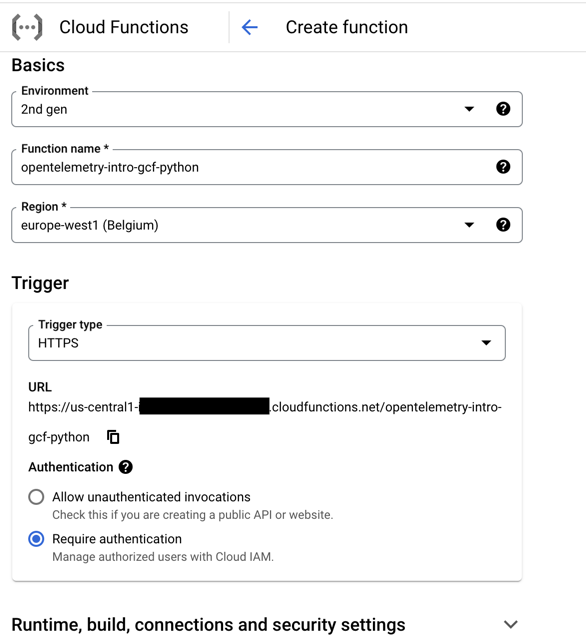
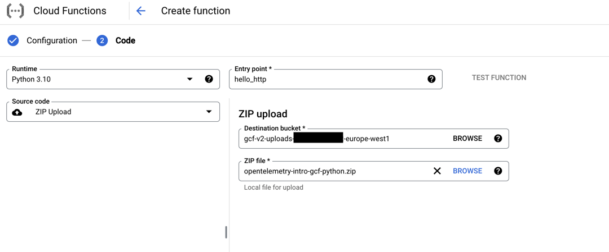
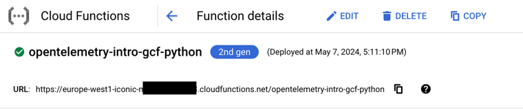
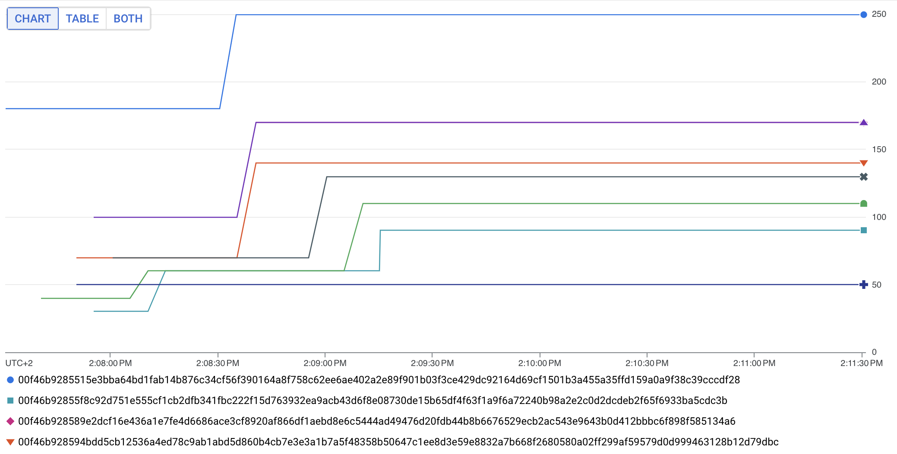

# opentelemetry-intro-gcf-python

This repository contains sample code for configuring OpenTelemetry in Python Google Cloud Functions.
It sets up the metrics client using OpenTelemetry APIs and send the metrics data periodically to Google Monitoring Service backend.

## Setup and Build
- Create a new project with pytoml in PyCharm using the existing resources or attach to an existing project.
- Generate the requirements file.
```bash
poetry export --without-hashes -n --output src/requirements.txt
```
- Create the zip file. 
```bash
zip -jr  opentelemetry-intro-gcf-python.zip ./src/*
```

## Deploy - UI

- Go to the Google Cloud Console and go to Cloud Functions.
- Create a new function named `opentelemetry-intro-gcf-python`.
- 
- Click next
- 
- After Deployment, a URL will appear at the top that represents the function invocation URL. 
- 

## Deploy - CLI

- Upload the zip file containing fat JAR to cloud storage
```bash
gcloud storage cp opentelemetry-intro-gcf-python.zip gs://<bucket_name>/functions/opentelemetry-intro-gcf-python.zip
```
- Deploy the google cloud function
```bash
gcloud functions deploy opentelemetry-intro-gcf-python --gen2 --runtime=python310 --region=europe-west1 --source=gs://<bucket_name>/functions/opentelemetry-intro-gcf-python.zip --entry-point=hello_http --memory=256MB --trigger-http
```
- Replace `<bucket_name>` with bucket of your choice.

## Testing
- Running the following curl command invokes the cloud function
```bash
curl -m 70 -X POST https://europe-west1-<project_id>.cloudfunctions.net/opentelemetry-intro-gcf-python -H "Authorization: bearer $(gcloud auth print-identity-token)" -H "Content-Type: application/json" -d '{  "name": "Dino Master" }'
```
- Expected output
```
Hello Dino Master!
```
- Replace `<project_id>` with your project id.
## Exploring Metrics in Google Monitoring Service

### Data generation
Run the following to generate data 

```bash
seq 100 | xargs -n 1 -P 10 -I {} curl -m 70 -X POST https://europe-west1-<project_id>.cloudfunctions.net/opentelemetry-intro-gcf-python -H "Authorization: bearer $(gcloud auth print-identity-token)" -H "Content-Type: application/json" -d '{  "name": "Dino Master" }'
```

Replace `<project_id>` with your project id.

### Metrics Explorer
Go to Metrics Explorer in Google Monitoring in the cloud console. Change to PromQL and add the following query.

```
custom_googleapis_com:function_opentelemetry_intro_gcf_python_danish_requests{monitored_resource="generic_task"}
```

You may see the following chart.


**Note:** If the metrics are not visible, see the logs, there might be `DEADLINE_EXCEEDED` error messages or any other errors from the exporter. They are intermittent and are resolved automatically. If the application is critical, one can use Collector as a proxy between the app and the Google Monitoring Service backend.  